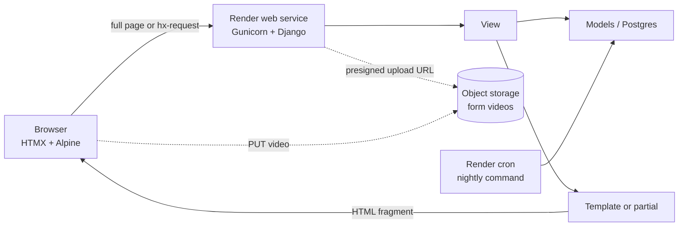
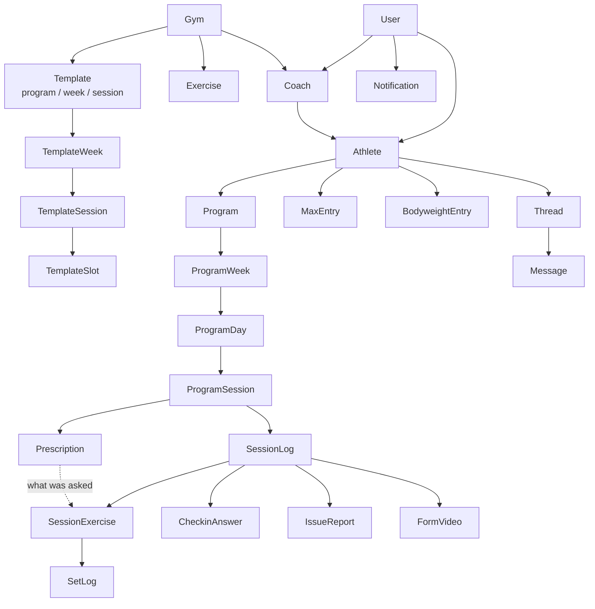

# GymTrainer Build Plan

*23 September 2026 · Steven*

The plan takes the single-file mockup (a coach desktop app plus an athlete phone app for weightlifting programming) to a production Django + HTMX site on Render in nine phases, for two part-time developers. Revised 23 September 2026 after review; the changes are listed at the end.

**How to use this plan when building.** The mockup at `mockup/index.html` is the visual and behavioural spec; this file is the technical spec. Work through the phases in order, one phase per branch, and treat each phase's "Delivers" cell as the checklist. When the mockup and this plan disagree on data shape, this plan wins (it has been through review); when they disagree on look or wording, the mockup wins. Keep the seed command in step with every model change so the app always has the mockup's demo data to click through.

## What the mockup already covers

The mockup is one 3,400-line HTML file with two personas (coach Dana on desktop, athlete Maya on a phone frame) sharing in-memory data. Everything below exists as a working screen in the mockup, so the design questions are mostly settled; the build is about persistence, accounts and multi-user behaviour. "Release" marks what goes in the first usable version (v1) versus what follows (v2).

### Coach side (desktop)

| Screen | What it does | Release |
| --- | --- | --- |
| Login / role select | Demo persona picker; becomes real email + password login | v1 |
| Dashboard | KPIs (active athletes, 7-day compliance, sessions this week, programs running out), sortable roster table, "needs attention" feed (issues, messages, videos, PRs, program expiry), sessions today, recent completed sessions | v1 (feed), KPIs v2 |
| Athletes roster | Card grid with filter, invite button | v1 |
| Athlete detail: Overview | e1RM trend chart with phase bands and bodyweight line, weekly volume + compliance chart, recent check-ins, week glance, lifetime PRs | charts v2, rest v1 |
| Athlete detail: Program | The centerpiece. Colour-coded week strip, 7-day board (columns or list view), select a day and add from the library rail, edit prescription modal (sets, reps, load, load basis, RIR, note, custom fields, swap to tagged alternative), duplicate/clear/save week, save as template, publish to athlete, undo | v1 (undo v2) |
| Library rail | Search + tag filter, per-athlete history strip on every exercise (last done, trend sparkline, never done), sort by last done, history popover | v1 (sparkline v2) |
| Athlete detail: Sessions | Completed session log: check-in answers, every logged set, RPE, comment, issue, videos; filter by exercise and date range | v1 |
| Athlete detail: Metrics | Bodyweight, height, snatch/C&J/squat 1RM, years training; coach fills in skipped fields; remind athlete; per-athlete check-in question builder | v1 |
| Athlete detail: Messages | One thread per athlete | v1 |
| Habits | Prescribe habits with emoji, cadence, note; 7-day tick history; habits attached to templates | v2 |
| Programming: Templates | Whole programs = weeks > sessions > slots; slot is a fixed exercise or a tag-based slot with a default; "written for N sessions/week"; template habits | v1 |
| Programming: Weeks and Sessions | Reusable single weeks and single sessions, saved out of any board or template | v2 |
| Programming: Exercises | Exercise CRUD: name, category, tags, YouTube demo, coaching cue, usage count | v1 |
| Programming: Check-in questions | Default question set (1-10 scale, multiple choice); push defaults to all athletes | v1 |
| Apply template to athlete | Pick template + athlete, then a live preview on their board: choose training days, start week, tag-slot mode (athlete's recent lifts or template defaults); ghost weeks until Confirm | v1 |
| Invite athlete | Email or link, choose starting template | v1 |
| Settings | Week-type colour legend, kg/lb units | v1 |

### Athlete side (phone)

| Screen | What it does | Release |
| --- | --- | --- |
| Home / week | Week strip with day status, today's session card, today's habits, coach's weekly focus note | v1 (habits v2) |
| Pre-session check-in | Coach's questions one per step, summary, skip option | v1 |
| Session player | One exercise per step: prescription banner, suggested kg from 1RM and %, last-done line, coach note, custom fields, YouTube demo, per-set kg/reps/RIR with tick, form video attach, cue | v1 (video v2) |
| Post-session | Session RPE 1-10, notes for coach, report issue or pain modal | v1 |
| Done | Stats, streak | v1 |
| Progress | Snatch e1RM chart, PR list, recent sessions | v1 list, chart v2 |
| Messages | Thread with coach, unread badge | v1 |
| Profile | Metrics list, fill in missing, sign out | v1 |
| Onboarding | Invite card, create account, training numbers (each skippable), done | v1 |

### Behaviour that lives in the mockup's JavaScript and must move to the server

- One session record per completed workout holds check-in answers, every set, RPE, comment, issue and videos. Per-exercise history, PRs and the check-in summary are derived from it, never stored twice.
- Estimated 1RM is load × (1 + reps/30), taken over every logged set; the best set wins, which is not always the heaviest.
- Suggested kg in the player = working max × percentage, rounded to the nearest plate step in the athlete's unit (0.5 kg or 2.5 lb). Each exercise names which max it is worked from (front squat from back squat, power snatch from snatch).
- Applying a template lays its sessions in order across the chosen weekdays and starts a new calendar week when the days run out.
- Tag slots resolve to the athlete's most recently performed exercise carrying all the slot's tags, else the default.
- Progressive template weeks bump every percentage load by a fixed number of points.
- "Program runs out in N days" and PR alerts are generated, not typed.

## Stack and architecture

Server-rendered Django with HTMX for partial updates, one Postgres database, one web service on Render. No JavaScript framework, no REST API, no separate front end. The mockup's CSS is kept as-is and ported into a static stylesheet, so the finished site looks like the mockup from day one.

| Layer | Choice | Why |
| --- | --- | --- |
| Language | Python 3.12 (already in the project venv) | Matches the local environment |
| Framework | Django 5.x, `django-htmx`, `django-template-partials` | Partials let one template serve both the full page and the HTMX fragment |
| Interactivity | HTMX 2 plus Alpine.js for purely local state (open/closed, selected day, set ticks before save) | Covers modals, live search, board edits and polling without a build step |
| Drag and drop | SortableJS (CDN) posting the new order via HTMX | Reordering prescriptions within a day and moving between days |
| Charts | Server-generated inline SVG (port the mockup's sparkline helper to a template tag) | No chart library; the mockup already draws them this way |
| Auth | Django auth with a custom User (email login); no role column, a user is a coach or athlete by having that profile; `django-allauth` only if social login is wanted later | A coach can log their own training as an athlete of themselves |
| Database | Postgres everywhere, including locally (Docker Compose) | Custom fields use JSON queries and names are unique ignoring case through functional constraints; SQLite would hide differences until deploy |
| Static files | WhiteNoise, `collectstatic` at build | No CDN or S3 needed for CSS/JS |
| Media (form videos) | S3-compatible bucket (Cloudflare R2 or Backblaze B2) via `django-storages`; direct-to-bucket upload with a presigned URL | Render's disk is not for user uploads; videos are large |
| Email | Transactional provider (Resend or Postmark) via `django-anymail` | Invites, password reset, weekly digest |
| Background work | Render Cron Job running a management command (nightly: program-runs-out alerts, missed-session status) | No Celery or Redis until something needs seconds-level scheduling |
| Live updates | HTMX polling (every 15-30 s on the dashboard feed and message threads); Server-Sent Events later if polling feels slow | Simple and free |
| Web server | Gunicorn behind Render's proxy | Standard |
| Tests | pytest-django for models and views; Playwright (already installed) for the four key flows | Playwright drives the athlete session flow end to end |

### How a request flows



A view checks `request.htmx`; when true it renders only the partial (a day column, a modal body, a message list) and the browser swaps it in place. Full-page loads render the same template with the layout around it.

### Two apps, one codebase

The coach app and the athlete app are two URL prefixes (`/coach/...` and `/app/...`) with two base layouts (sidebar shell and phone shell). A user's role decides which one they land on after login. The athlete app is built mobile-first and served as a PWA (manifest plus service worker) so it installs to the home screen; a native wrapper is not planned.

## Data model

About 30 models in eight groups. The design rule from the mockup carries over: the completed session record is the single source of truth, and exercise history, PRs, e1RM, compliance and day status are queries over it. Library objects (exercises, templates, default questions) are owned by a `Gym`, so coaches at one gym share them; a solo coach is a gym of one. A person is a coach or an athlete because they have that profile row, not because of a role flag, so a coach can also log their own training.



Read top-down: the gym owns libraries, libraries are copied onto an athlete's program, and the athlete's completed sessions hang off program sessions while keeping a link to what was prescribed.

### Accounts and onboarding

| Model | Key fields | Notes |
| --- | --- | --- |
| User | email (login), password, name, timezone | Custom `AbstractUser`, set before the first migration. No role column: a Coach row makes a coach, an Athlete row makes an athlete, and one user can have both. After login the coach app wins when both exist, with a switcher |
| Gym | name, units (kg / lb), timezone, week_start (Monday or Sunday) | Owns the exercise library, categories, tags, week types, templates and default check-in questions. Created with the first coach account, who picks a starter pack (see below) |
| Coach | user, gym, title | |
| Athlete | user, coach, gym, weight_class, competition_name, competition_date, height_cm, years_training, units (defaults from gym), joined_at, archived_at | Archive, never delete, so session history survives. Bodyweight and maxes are history tables below, not columns here. The athlete's time zone is `User.timezone`, defaulted from the gym when they join |
| Invite | coach, email, token, starting_template, status, expires_at, accepted_by | Backs the invite link and onboarding |

### Athlete measurements (history, not single fields)

| Model | Key fields | Notes |
| --- | --- | --- |
| BodyweightEntry | athlete, date, kg (Decimal 5,2), source (athlete / coach / session) | The latest row is the current bodyweight; the overview chart draws its dashed line from these |
| MaxEntry | athlete, exercise, date, kg (Decimal 6,2), reps (1 for a true max), source (onboarding / coach / session PR) | The latest row per exercise is the working max that percentages are taken from. "Not provided" means no row. A session PR adds a row rather than overwriting |

### Exercise library

| Model | Key fields | Notes |
| --- | --- | --- |
| Exercise | gym, key, name, category (FK Category), tags (M2M Tag), measure (reps / time / distance), reps_per_rep (1, or 2 for a "1+1" complex), percent_of (self FK, nullable), youtube_url, cue, archived | `percent_of` names the max a percentage is worked from: front squat from back squat, power snatch from snatch, an accessory from nothing (percentage loads then show as-is) |
| Category | gym, name (≤40), order | The gym's own categories, ordered by the coach, names unique per gym ignoring case. Deleting one that has exercises (archived included) asks which category to move them to first |
| Tag | gym, name (≤24) | The gym's own tags, unique per gym ignoring case. Deleting one removes it from exercises; the exercises stay |
| TrackedLift | gym, exercise, order | The gym-wide, ordered list of lifts whose maxes are tracked: asked at onboarding, shown on the Metrics tab and athlete header, listed in reminders. Edited in Settings, at most 6. Only active, rep-measured exercises of the gym. New gyms start with snatch, clean & jerk and back squat. Archiving an exercise untracks it; recorded maxes are kept |

Exercises are archived rather than deleted. An archived exercise can then be deleted permanently after a warning that lists what goes with it (athletes' max entries, and exercises that take percentages from it, which fall back to their own max). `apps/exercises/deletion.py` is the one place that knows everything pointing at an exercise; every later model with a foreign key to Exercise must be added there, and a test fails until it is. Starter-library exercises carry a `key`, used only to refresh the library without duplicates; no feature may depend on it.

### Week types and starter packs

| Model | Key fields | Notes |
| --- | --- | --- |
| WeekType | gym, name (≤30), description, colour (#RRGGBB), order, archived | The gym's own week types, edited in Settings. They colour the program editor, week strip and session cards through inline CSS variables. One that anything uses is archived instead of deleted, so past weeks keep it; "in use" is counted from every model pointing at WeekType, so new ones count automatically |

At sign-up the coach picks a starter pack: **Olympic weightlifting** (the mockup's 24 exercises, 8 categories, 13 tags, 6 week types; tracks snatch, clean & jerk, back squat), **General strength** (30 exercises across squat, hinge, push, pull, single-leg, core, carry, conditioning, mobility; week types Hypertrophy, Strength, Power, Deload, Testing; tracks back squat, bench press, deadlift), or **Start empty** (no exercises; four categories and three week types to build from). Everything a pack adds is the gym's own and editable. Installing a pack only adds what's missing and never changes what a coach edited. Starter exercises ship without demo links.

### Shared prescription fields

A template slot and a program prescription describe the same thing: one exercise's dose in one session. One abstract Django model, `PrescriptionBase`, holds the fields below and both `TemplateSlot` and `Prescription` inherit it, so applying a template copies every field and the two can never drift apart.

| Field | Type | Notes |
| --- | --- | --- |
| sets | int | Number of sets |
| rep_scheme | text | What the athlete reads: "5", "1+1", "8/leg", "10 min" |
| reps | int, nullable | Reps per set for rep-based work, used for e1RM; a complex counts as 1 |
| duration_seconds | int, nullable | Timed work such as "20 min Z2"; reps is then null |
| load_value | Decimal, nullable | The number only: 75 (percent), 8 (RPE), 120 (kg) |
| load_basis | choice | percent_of_max / rpe / kg / bodyweight / none |
| rir | int, nullable | Reps in reserve target |
| note | text | Note to athlete |
| custom_fields | JSON list of {key, value} | Coach-written labels shown to the athlete (Rest: 3 min, Tempo: 5-0-X). The athlete reads them and does not fill anything in, so no answer table is needed |

Per-set variation such as 70/75/80% uses a child row per set, `PrescribedSet` (parent, set_number, reps, load_value), one concrete table each for slots and prescriptions from a shared abstract base. No child rows means every set follows the parent. The editor shows the simple form by default and a "vary by set" toggle that expands the rows.

### Templates (reusable library)

One `Template` model with a `kind` field replaces the mockup's three lists (templates, saved weeks, saved sessions). A saved week is a template of kind `week` with one week; a saved session is kind `session` with one week holding one session. Applying any of them uses one code path.

| Model | Key fields | Notes |
| --- | --- | --- |
| Template | gym, created_by, kind (program / week / session), name, description, sessions_per_week | |
| TemplateWeek | template, order, week_type (FK WeekType), focus_note | |
| TemplateSession | week, order, name | |
| TemplateSlot | session, order, kind (exercise / tag), exercise, tags (M2M Tag), default_exercise, plus every PrescriptionBase field | Tag slots need tags plus default_exercise |
| TemplateSlotSet | slot, set_number, reps, load_value | Per-set overrides |
| TemplateHabit | template, name, emoji, cadence, note | Copied to the athlete on apply |

### Athlete program (what the athlete sees)

| Model | Key fields | Notes |
| --- | --- | --- |
| Program | athlete, name (the block), start_date, active, source_template (phase 5), created_by, created_at | One active program per athlete, enforced by a partial unique index; starting a new one ends the current one, which is kept for history. Weeks are back-to-back from start_date |
| ProgramWeek | program, order, week_type (FK WeekType), start_date (the gym's week-start day when the program began), focus_note, published, published_at | The coach's "focus this week" note lives here. The athlete app reads published weeks only; edits to a published week are live immediately. Weeks are consecutive: inserting or deleting one shifts every later week's dates. The label ("Wk 3") is derived |
| ProgramDay | week, date | Seven per week, unique on (week, date). No status or rest flag: a day with no sessions in a published week is a rest day, and done, missed and today are worked out from session logs and the date (see derived values) |
| ProgramSession | day, order, name, source_template_session | Usually one per day; a second one covers morning and evening sessions. The mockup shows one, so the UI adds a second only on demand |
| Prescription | session, order, exercise, tag_slot_tags (M2M Tag, empty when fixed), plus every PrescriptionBase field | Tags are rows, not strings, so renaming a tag updates slots and prescriptions too |
| PrescribedSet | prescription, set_number, reps, load_value | Per-set overrides |
| EditHistory | program_week, coach, created_at, snapshot (JSON) | One row per board mutation; undo restores the latest and deletes it. Pruned to the last 50 per week |
| Habit | athlete, name, emoji, cadence (daily / training days / 3x / 5x), note, source_template, archived | |
| HabitLog | habit, date, done | Unique on (habit, date) |

### Session records (the source of truth)

| Model | Key fields | Notes |
| --- | --- | --- |
| SessionLog | athlete, program_session (nullable), started_at, finished_at, name, week_type (FK WeekType), checkin_skipped, session_rpe, comment | One per workout; a paused session has no finished_at. Nullable link so an athlete can log an unprogrammed session |
| SessionExercise | session_log, prescription (nullable), exercise, order, prescribed (JSON snapshot of the prescription and its per-set overrides when the session was logged) | Holds "asked for X" beside "did Y". Coaches may still edit a completed day, so "asked for" is read from the snapshot, never from the live prescription |
| SetLog | session_exercise, set_number, load_kg (Decimal 6,2), reps, duration_seconds, rir, done, logged_at | Loads always in kg, exact; a complex logs one rep of the complex; timed work logs seconds and null reps |
| CheckinQuestion | owner (gym defaults or one athlete), order, type (scale / multiple choice), text, low_label, high_label, options (JSON), archived | Each athlete gets a copy on join; "push defaults" overwrites copies. Archive rather than delete so old answers keep their question |
| CheckinAnswer | session_log, question (FK), question_text (snapshot), type, value, other_text | The FK keeps trend charts working after a reword; the snapshot keeps history readable if the question is archived |
| IssueReport | session_log (nullable), athlete, kind, text, created_at, resolved_at | Also reachable outside a session |
| FormVideo | session_log, exercise, file (bucket key), note, uploaded_at, reviewed_at | Upload goes straight to the bucket; the row stores the key |

### Messaging and notifications

| Model | Key fields | Notes |
| --- | --- | --- |
| Thread | coach, athlete, created_at | One per coach-athlete pair, so a new coach starts a fresh thread and never sees the old one |
| Message | thread, sender, body, sent_at, read_at | |
| Notification | recipient (User), athlete, kind (issue / message / video / pr / program_ending / metrics_missing / week_published), dedupe_key, text, link, created_at, read_at | Unique on (recipient, kind, dedupe_key), for example `program_ending:<program id>`, so the nightly job upserts and an alert fires once. Athletes receive notifications too (week published, new message) |

### Derived values, not columns

- Day status: done when a finished SessionLog points at one of the day's sessions; missed when the date is past in the athlete's time zone and none does; upcoming otherwise. Today is the date in the athlete's time zone.
- Suggested kg: load_value percent of the latest MaxEntry for `exercise.percent_of` (or the exercise itself), rounded to the plate step of the athlete's unit for display. The stored value is never rounded.
- e1RM per set = load × (1 + reps/30); an exercise's session e1RM is the best set, not the heaviest.
- Per-exercise history for the library rail: session e1RM per SessionExercise, ordered by date, last ten.
- Lifetime PRs: heaviest single and best e1RM, both shown, since they answer different questions.
- 7-day compliance: done days ÷ scheduled days in the last 7 calendar days.
- Weekly volume: sum of load × reps over SetLogs per ISO week.
- "Program runs out in N days": last ProgramDay date minus today, computed nightly into a Notification.
- Streak: consecutive scheduled days marked done, counted backwards from today.
- Time: datetimes stored in UTC; anything called "today" or "this week" is computed in the athlete's time zone, and the coach dashboard uses the gym's.

These are cheap at the scale of one gym with tens of athletes. Cache or denormalise only if a page measures slow.

## Build phases

Nine phases, each ending with something deployed and clickable on Render. Phases 0 to 4 give a coach a usable v1: invite an athlete, build their week, and see what they logged. Effort assumes two people at roughly 8 to 10 hours a week each; treat the weeks as a first guess and re-estimate after phase 2.

| Phase | Delivers | Depends on | Weeks |
| --- | --- | --- | --- |
| 0. Foundation | GitHub repo, Django project, custom User, Postgres locally in Docker Compose and on Render, Render web service deploying from `main`, WhiteNoise, base layouts (coach shell and phone shell) with the mockup's CSS ported, HTMX and Alpine wired, pytest and Playwright running in CI | nothing | 1 |
| 1. Accounts | Email login, password reset, Gym, Coach and Athlete models, bodyweight and max history tables, invite by email or link, athlete onboarding (account, skippable metrics, done screen), gym Settings, time zones | 0 | 1.5 |
| 2. Exercises and roster | Exercise CRUD with tags and search, athletes roster and detail shell (tabs), Metrics tab with coach edit and "remind athlete", check-in question builder (defaults plus per-athlete copy) | 1 | 1.5 |
| 3. Program editor | Program, weeks, days, sessions, prescriptions and per-set overrides; week strip; board in columns and list view; add from library rail; edit prescription modal with custom fields and swap; duplicate and clear week; publish to athlete (published flag on the week) | 2 | 3 |
| 4. Athlete app core | Home week strip and today card; check-in flow; session player with suggested kg, per-set logging, last-done line; post-session RPE, comment, issue report; done screen; SessionLog and SessionExercise written with the prescription link; session PRs add MaxEntry rows; coach Sessions tab (asked vs did); library rail history strip; Progress screen (PR list, recent sessions); Profile | 3 | 3 |
| 5. Templates and apply | Template editor (weeks > sessions > slots, tag slots, habits); saved weeks and sessions; apply-to-athlete preview with day picker, start week and tag-slot mode; ghost weeks; confirm writes the program | 3, 4 (tag-slot "recent lifts" mode needs history) | 2.5 |
| 6. Dashboard and messaging | Notifications generated from issues, messages, videos, PRs and program expiry (nightly cron); dashboard feed, sessions today, recent sessions, KPIs; roster sort by attention; coach-athlete messages with unread badges and polling | 4 | 2 |
| 7. Habits and charts | Habits prescribed per athlete and via templates, daily ticks; e1RM chart with phase bands and bodyweight, weekly volume chart, athlete progress chart, library sparklines; undo in the editor | 5, 6 | 2 |
| 8. Videos and polish | Form video upload to object storage, coach review; PWA manifest and install prompt; email digest; kg/lb display; accessibility pass; error pages; production hardening (rate limits, backups verified) | 4, 6 | 2 |

Total: about 18 to 19 weeks of part-time work, so a v1 (through phase 4) in roughly 10 weeks and the full mockup in four to five months. Phases 5 and 6 can run in parallel once phase 4 lands, which is where two people help most.

### Definition of done for a phase

- Deployed to Render and exercised by the other person, not only the author.
- Models have tests; each new page has at least one view test; the athlete session flow has a Playwright test from phase 4 on.
- Seed command (`manage.py seed_demo`) updated so a fresh database shows the mockup's Dana and Maya data.
- No feature is "done" while it works only in the mockup's JavaScript.

## HTMX interaction map

Every dynamic piece of the mockup maps to one of five HTMX patterns. The rule: the server owns state, the browser owns only what is visibly in progress (an open modal, the selected day, unsaved set ticks). Nothing lives in JavaScript arrays the way it does in the mockup.

| Mockup behaviour | Pattern | How it works |
| --- | --- | --- |
| Sidebar panels, athlete tabs, programming tabs | Real URLs with `hx-boost` | Each panel and tab is its own URL; `hx-boost` on the shell swaps the main region and keeps the sidebar. Back button works |
| Modals (edit prescription, new exercise, invite, metric, issue, slot, save week, pick week, apply) | `hx-get` a modal partial into an empty `#modal` target | The partial is a `<dialog>`; submit is `hx-post` returning either the re-rendered target (day column, table row) plus an empty modal, or the form with errors |
| Library search and tag filter | `hx-get` with `hx-trigger="keyup changed delay:250ms, click from:.tagchip"` | Returns only the list partial; per-athlete history is computed in the view |
| Select a day, then "+" on a library item | Alpine holds `selectedDay`; the add button is `hx-post` with the day id in `hx-vals` | Response is the day column partial with `hx-swap-oob` for the library item's usage count |
| Remove, edit, swap a prescription | `hx-post` or `hx-delete` on the item; response re-renders the day column | The swap list is the same modal with a different partial |
| Drag exercise between days, reorder within a day | SortableJS `onEnd` posts `{prescription, day, order}` via `htmx.ajax` | Server reorders and returns both affected columns with `hx-swap-oob` |
| Duplicate week, clear week, change week type | `hx-post` on the toolbar; response re-renders the week strip and the board | A `hx-confirm` on clear |
| Publish to athlete | `hx-post` flips `ProgramWeek.published`; badge on the strip | The athlete app only reads published weeks |
| Undo (phase 7) | Server-side: each board mutation stores a JSON snapshot in an `EditHistory` row; undo restores the last one | Simpler than client history and survives reload |
| Apply-template preview with ghost weeks | The preview is a server-side draft: `POST /coach/apply/start` stores the plan in the session; day picks and start week re-post and re-render the ghost board; Confirm writes real rows | No client planner; the mockup's `planWeeks` becomes a Python function used by both preview and confirm |
| Template editor (weeks > sessions > slots) | Same patterns as the board: partials per week card and per session | Slot modal is `hx-get`/`hx-post` like the prescription modal |
| Toasts | Views set the `HX-Trigger` response header with a `toast` event; a tiny listener appends the toast | One place, every view can use it |
| Dashboard feed, unread badges, message threads | `hx-get` with `hx-trigger="every 20s"` on the feed and the thread | Marking read is `hx-post`; the sidebar count comes back out-of-band |
| Athlete week strip and day card | Plain links per day; today's card has "Start session" | No HTMX needed |
| Check-in flow | One URL per step (`/app/session/<id>/checkin/<n>`), answers posted step by step into the SessionLog | Refreshing mid-flow keeps progress |
| Session player | One URL per exercise; set rows are a form; Alpine ticks sets locally; each tick or blur does `hx-post` to save that set | Nothing is lost if the phone locks or the browser closes; "Prev" and "Next" are links. A failed save keeps the row marked unsaved and retries; a true offline queue is a v2 decision (see open decisions) |
| Post-session, done | Normal form post, then redirect | |
| Charts | Template tag renders SVG server-side; the lift selector is `hx-get` returning the SVG | Same maths as the mockup's `sparkSVG` |
| Form video | Button asks the server for a presigned URL, browser PUTs the file to the bucket, then `hx-post` the key to attach it | Django never proxies video bytes |

### Conventions

- One template per page under `templates/coach/` or `templates/app/`; partials in `templates/partials/` named after the model they render (`day_column.html`, `prescription_item.html`, `library_item.html`).
- Views return `TemplateResponse` with the full template; a `partial` name is chosen when `request.htmx` is true, using `django-template-partials` so the fragment and the page share one file.
- All mutations are `POST`, `PUT` or `DELETE` with the CSRF token sent via `hx-headers` on the body tag.
- Every coach view filters by `request.user.coach`; every athlete view by `request.user.athlete`. A `CoachRequiredMixin` and `AthleteRequiredMixin` enforce this so no view can leak another coach's data.

## Project layout

Seven Django apps, split by the data model groups above, so two people can work in different apps without merge conflicts. The app holding session logs is called `workouts`, not `sessions`, because `sessions` is the label of Django's own `django.contrib.sessions` and the project would refuse to start.

```
gymtrainer/
  manage.py
  requirements.txt            # or pyproject.toml with uv
  render.yaml                 # Render blueprint (see deployment)
  config/
    settings/base.py, local.py, production.py
    urls.py                   # mounts /coach/, /app/, /accounts/
    wsgi.py
  apps/
    accounts/    User, Gym, Coach, Athlete, Invite, BodyweightEntry, MaxEntry; login, invite, onboarding views
    exercises/   Exercise, categories, tags; library CRUD and search partials
    library/     Template, TemplateWeek, TemplateSession, TemplateSlot, TemplateHabit; editor; apply planner
    programs/    Program, ProgramWeek, ProgramDay, ProgramSession, Prescription, PrescribedSet, EditHistory, Habit, HabitLog; the board editor
    workouts/    SessionLog, SessionExercise, SetLog, CheckinQuestion, CheckinAnswer, IssueReport, FormVideo; athlete flows; history queries
    messaging/   Thread, Message; threads and polling partials
    dashboard/   Notification; feed, KPIs, nightly management command
  templates/
    base_coach.html           # sidebar shell (from the mockup's .coach-shell)
    base_app.html             # phone shell (from .phone / .app-tabbar)
    coach/  app/  accounts/  partials/  emails/
  static/
    css/app.css               # the mockup's CSS, split into tokens, primitives, coach, app
    js/app.js                 # toast listener, Sortable wiring, small helpers
    vendor/                   # htmx, alpine, sortable pinned copies
  tests/
    unit/                     # pytest-django per app
    e2e/                      # Playwright: invite+onboard, build a week, run a session, apply a template
```

### Porting the mockup's front end

- Copy the CSS wholesale first, then delete rules as screens are rebuilt; do not restyle while porting.
- The CSS-mask icon set stays; move it to its own file.
- The `.view` and `.cpanel` show/hide classes go away; those become URLs.
- Week type colours come from each gym's WeekType rows and are applied as inline CSS variables (`--wkc`, `--wkl`) that the mockup's `.wk-pill`, `.wk-tab` and `.rx-item` styles already read.
- Fonts: keep Inter from Google Fonts or self-host it in `static/fonts` (self-hosting avoids the external request on the athlete's phone).

### Seed data

A `seed_demo` management command creates the mockup's coach, six athletes, 24 exercises, the five template session sets, the current programs and about 40 session logs. It runs after every fresh deploy to a preview environment and is what both of you use locally. Write it in phase 0 and grow it with each phase; it doubles as living documentation of the model.

## Render deployment

Three Render resources, declared in a `render.yaml` blueprint in the repo so the whole environment is reproducible: a web service, a Postgres database, and one cron job. Render builds from GitHub on every push to `main`.

| Resource | Plan | Purpose |
| --- | --- | --- |
| Web service (Python) | Starter paid tier | Free web services spin down when idle and take tens of seconds to wake, which an athlete mid-session will feel |
| Postgres | Smallest paid instance | Render's free Postgres is time-limited and has no backups; the paid tier includes daily backups. Check current pricing at render.com/pricing |
| Cron job | Runs `manage.py nightly` once a day | Program-expiry notifications, mark missed days, send the coach digest |
| Object storage | Not on Render: Cloudflare R2 or Backblaze B2 bucket | Form videos (phase 8) |

### Blueprint sketch

The web service and the cron job share one environment variable group, so the cron job has the same database and settings as the site. A cron job without those would fail on its first run.

```yaml
envVarGroups:
  - name: gymtrainer-shared
    envVars:
      - key: DJANGO_SETTINGS_MODULE
        value: config.settings.production
      - key: SECRET_KEY
        generateValue: true
      - key: ALLOWED_HOSTS
        value: gymtrainer.onrender.com
      - key: EMAIL_API_KEY
        sync: false            # set in the dashboard, never in the repo

services:
  - type: web
    name: gymtrainer
    runtime: python
    buildCommand: pip install -r requirements.txt && python manage.py collectstatic --noinput
    preDeployCommand: python manage.py migrate
    startCommand: gunicorn config.wsgi:application
    healthCheckPath: /healthz
    envVars:
      - fromGroup: gymtrainer-shared
      - key: DATABASE_URL
        fromDatabase: { name: gymtrainer-db, property: connectionString }
  - type: cron
    name: gymtrainer-nightly
    runtime: python
    schedule: "0 3 * * *"
    buildCommand: pip install -r requirements.txt
    startCommand: python manage.py nightly
    envVars:
      - fromGroup: gymtrainer-shared
      - key: DATABASE_URL
        fromDatabase: { name: gymtrainer-db, property: connectionString }
databases:
  - name: gymtrainer-db
```

### Environment variables

| Variable | Set where | Notes |
| --- | --- | --- |
| SECRET_KEY | Render generates | Never in the repo |
| DATABASE_URL | From the database resource | Parsed by `dj-database-url` |
| ALLOWED_HOSTS, CSRF_TRUSTED_ORIGINS | Render dashboard | Add the custom domain when bought |
| EMAIL_API_KEY, DEFAULT_FROM_EMAIL | Render dashboard | Provider key for invites and resets |
| STORAGE_BUCKET, STORAGE_ACCESS_KEY, STORAGE_SECRET, STORAGE_ENDPOINT | Render dashboard | Phase 8 |
| SENTRY_DSN | Render dashboard | Optional error tracking; free tier is enough |

### Production settings checklist

- `DEBUG = False`, `SECURE_SSL_REDIRECT`, `SESSION_COOKIE_SECURE`, `CSRF_COOKIE_SECURE`, HSTS on. Render terminates TLS, so set `SECURE_PROXY_SSL_HEADER`.
- WhiteNoise with `CompressedManifestStaticFilesStorage`.
- Gunicorn with 2 to 3 workers on the Starter plan; logs to stdout so Render captures them.
- A `/healthz` view that touches the database.
- Django `LOGGING` set to JSON-ish single lines; Render's log search is enough at first.
- Migrations run in `preDeployCommand`, so a failed migration blocks the deploy instead of half-applying.

### Environments

- Local: Postgres in Docker Compose (`docker compose up db`), `settings.local`, `seed_demo` data. No SQLite anywhere.
- Preview: Render Preview Environments on pull requests (optional; each spins up its own database, so turn it on only for phases with risky migrations).
- Production: `main` branch. Rollback is Render's "redeploy previous" plus a restored database backup if a migration went wrong; back up before every migration that drops or renames a column.

## Working together

One GitHub repository, short-lived branches, a pull request for everything, and Render deploying `main`. The split below keeps each person in different apps most of the time.

### Suggested split

| Area | Owner A | Owner B |
| --- | --- | --- |
| Phase 0 | Django project, settings, Render, CI | Port CSS, base layouts, HTMX and Alpine wiring, seed command |
| Phases 1 to 2 | accounts app: login, invites, onboarding | exercises app, roster and athlete detail shell, metrics, question builder |
| Phases 3 to 4 | programs app: the board editor | workouts app: athlete check-in, player, post-session, history |
| Phases 5 to 6 | library app: templates and apply | dashboard and messaging apps |
| Phases 7 to 8 | Charts, undo | Habits, videos, PWA |

Swap owners for review: the person who did not write a phase tests it on Render and signs it off.

### Process

- Issues: one GitHub issue per row of the phase table, grouped into a milestone per phase. Use a GitHub Project board only if the issue list gets hard to scan.
- Branches: `feature/<issue>-short-name` off `main`; rebase before opening the PR; squash-merge.
- Reviews: every PR gets one review, same day when possible. Small PRs (under 400 lines) over big ones.
- CI on each PR: `ruff`, `pytest`, `manage.py makemigrations --check`, Playwright on the e2e folder.
- Migrations: never edit a migration that has reached `main`; add a new one.
- Weekly 30-minute call: demo what landed, pick next issues, update the phase estimates in this doc.
- Decisions go in a `docs/decisions.md` in the repo (one dated line each) so they are not lost in chat.

### Shared setup

- Python 3.12, `uv` or plain venv, `pre-commit` with `ruff` format and lint.
- A `.env.example` listing every variable from the deployment section.
- `make dev` (or a `justfile`): migrate, seed, runserver. One command to a working local site.

## Open decisions and risks

The review settled most of the original list. What remains is below; decide the first three before phase 1.

### Decided (during the 23 September review)

- Ownership: a `Gym` owns exercises, templates and default questions; coaches at one gym share them. A solo coach is a gym of one.
- Roles: no role column. Coach and athlete are profiles, and one person can have both.
- Units: store every weight as an exact decimal in kg; round only for display, to 0.5 kg or 2.5 lb in the athlete's unit.
- Maxes and bodyweight: history tables, latest row wins. A session PR adds a row.
- Percent loads: each exercise names the max it is worked from.
- Two sessions in a day: supported in the model from the start (ProgramSession); the UI shows one until a coach adds a second.
- Loads that differ per set: supported by per-set override rows, hidden behind a "vary by set" toggle.
- Complexes and timed work: `rep_scheme` is the text the athlete reads; `reps` and `duration_seconds` hold the numbers.
- PR definition: show both the heaviest single and the best e1RM.
- Custom fields: coach-written labels only; the athlete does not fill them in.
- Day status, compliance, streak: always derived from session logs, never stored.
- Time zones: UTC in the database; "today" is computed in the athlete's zone, the dashboard in the gym's.
- Deleting an athlete: archive only.

### Decided (23 September, while building phase 2)

- Tracked lifts are a gym-wide ordered list in Settings, not fixed. Archiving a tracked lift untracks it and keeps its history.
- Bodyweight, height and years training stay fixed metrics for every gym; custom metrics can come later.
- Archived exercises can be deleted permanently after a warning listing what goes with them.
- Categories, tags and week types are per gym and editable. Tag names are at most 24 characters.
- Deleting a category that has exercises offers to move them to another category.
- A new gym chooses a starter pack: Olympic weightlifting, General strength, or Start empty (no exercises, basic categories and week types).

### Decided (23 September, before phase 3)

- Program weeks are back-to-back calendar weeks; inserting or deleting a week shifts every later week.
- Each gym sets whether its week starts on Monday (default) or Sunday.
- Edits to a published week go live immediately; the week shows a "live" badge and can be unpublished.
- Days with a completed session stay editable; each logged session keeps a snapshot of what was prescribed.

### Decided (23 September, before phase 4)

- Session PRs and maxes: each athlete has a setting, "coach approves" (default) or "update automatically". Only a real lift counts: the heaviest load done for 1+ reps above that exercise's own working max, logged on or after the max's date. e1RM never changes a max. Exercises with no max on file never get one from a session. Pending PRs show on the athlete's Metrics tab ("Use as working max" / "Keep"); the dashboard alert is phase 6.
- Which sessions an athlete can log: today's; missed days afterwards (dated to the planned day, check-in skipped); upcoming days are view-only, for planning. Unprogrammed workouts are not in v1 (the model allows them).
- Finished sessions can be edited for 24 hours; an edit re-checks automatic maxes.
- Deleting an exercise that has been logged keeps the history by name (SessionExercise.exercise_name) with every set; the link is cleared, so it drops out of trends, PRs and "last done".
- Logged sessions are history: a coach can't insert or delete a week that would move or delete a logged day, can't delete a logged session, and removing its last exercise keeps the session.

### Decided (23 September, before phase 5)

- Template habits are edited in the template now and copied to the athlete when athlete habits exist (phase 7).
- Progressive weeks: "+ Add week" copies the previous week and can add N percentage points to every % load; other loads are unchanged.
- Applying: after the last week, from a future week (empty weeks are replaced, weeks with work move after), or as a new program this week or next (the current one ends and is kept). New weeks arrive unpublished unless "publish now" is ticked. Appending isn't offered once a program has ended.
- An invite can carry a starting template; on joining it becomes an unpublished draft program from the next week, on the template's default days.
- Deleting an exercise removes its fixed template slots; a tag slot that defaults to it switches to another exercise with the same tags (removed if there is none).

### Decided (23 September, before phase 6)

- The coach's feed shows issues, messages, session PRs (waiting, or applied automatically), programs running out within 7 days (or no program), missing metrics and sessions missed in the last 7 days. Form videos join in phase 8.
- Items clear themselves when handled (thread read or replied to, PR decided, issue marked resolved, weeks added, metrics filled in, a missed day logged afterwards); ✓ marks one read and "Clear read" removes read items.
- Athletes see an unread-message badge on the message icon and the Coach tab; a newly published week just appears on their strip.

### Decided (24 September, before phase 7)

- Habit cadences are target-based: every day (streak in days); training days (due only on days with a session; streak over those days); 3× / 5× a week (due until the week's target is met, then "done for this week"; streak in weeks). Today never breaks a streak before it's over.
- Athletes can tick habits for today and yesterday.
- Undo covers edits within a week (exercises, sessions, names, clear week, week type, focus note), the last 50 per week, with Ctrl+Z. Adding, duplicating or deleting weeks and applying templates aren't undoable. Undo never removes a session an athlete has logged.

### Decided (24 September, before phase 8)

- Exercise demo videos stay YouTube links that open in YouTube (the athlete app never embeds them). Athletes' own form videos are uploaded to Cloudflare R2 for the coach to check; the coach may watch them in the page on desktop.
- Form videos: at most 200 MB each, 3 per exercise, deleted 90 days after upload (the session keeps a note and the feedback).
- Reviewing: the coach watches, writes feedback (sent into the athlete's messages, quoting the video) and marks it reviewed.
- A daily digest email at 7am gym time, only when something new needs attention; each coach can turn it off in Settings. The cron job runs hourly.
- Accessibility: the mockup's text colours are darkened just enough to meet WCAG AA contrast (backgrounds and borders unchanged).

### Decided (24 September, phase 9: the client's spreadsheet)

The client sent a real program (`mockup/Export For Sir Steven.xlsx`, a real athlete's data, so it is only used anonymised). It showed how he programs; phase 9 fills the gaps it exposed.

- He programs everything by RIR, often as a range ("@1-2RIR"), with rep ranges ("10-12", "15-20") and per-set RPE on the main lift (8/9/7). The RIR target takes a number or a range (`rir`, `rir_max`); a rep range counts its low end for the maths and is suggested at that in the player.
- Warm-ups are drills whose name is a link to a YouTube demo, with free-text doses ("x 5 breaths + 5 shifts"). They are library exercises (an exercise can be marked "Warm-up drill"), prescribed as warm-up items that always sit first in a session. The athlete gets a checklist screen before the first lift: tap the name for the demo, tick it off. No sets are logged and they don't count towards sets or volume.
- Sections and supersets: an item can start a section heading with a note ("Hypertrophy — superset non-competing exercises") and can be paired with the item above it as a superset (A1/A2). The player shows a superset's exercises on one screen.
- Check-ins get a short-answer question type (may be left empty), and a 1-10 question can ask for a few words too ("Soreness 1-10" then "Where?").
- A program has a note (goal, rest, nutrition), edited on the board and shown on the athlete's week and Progress pages. Templates carry one, which becomes the program note when applied as a new program.
- seed_demo adds Riley (made up, in pounds) on "Meso 1 — Powerbuilding", built from the sheet with its YouTube links and paraphrased notes.

### Still open

- [ ] Product name and domain (the mockup says "Platform"; the repo is GymTrainer).
- [ ] Offline set logging. v1 saves each set as it is ticked and retries a failed save; if gym signal turns out to be a real problem, v2 adds a service-worker queue that replays saves when back online. Decide after the first athletes use phase 4.
- [ ] Do athletes pay, does the gym pay, or is billing out of scope for now? Affects whether Stripe goes in the plan.
- [ ] Can an athlete have two coaches at the same gym? The plan assumes one.

### Risks

- The program editor (phase 3) and the apply preview (phase 5) are the two hardest pieces; the mockup's undo and ghost-week logic are client-side and need redesign as server state. Budget the extra week there, not in phases 1 and 2.
- Two people porting the same CSS file at once will conflict. One person owns the port in phase 0; the other waits on it.
- Playwright tests against a phone-sized viewport are slower to write than they look. Keep them to the four core flows.
- Video storage costs scale with athlete count; keep uploads behind a size cap and a retention period.
- Estimates assume the mockup's design is final. Any screen redesign during the build costs more than it would have in the mockup.

## Changes from the review (23 September 2026)

Every note from the review and what changed in this plan, in the reviewer's order.

| Review note | Change |
| --- | --- |
| Rename the `sessions` app | Renamed to `workouts` in the layout and ownership split |
| Postgres locally | Docker Compose Postgres from phase 0; SQLite removed everywhere |
| Real date on each program day | `ProgramDay.date`, unique with the week |
| Two sessions in a day | `ProgramSession` between day and prescription; UI shows one by default |
| Do not store done or missed | Status column removed; derived from session logs and the date |
| Link sets to what was prescribed | `SessionExercise.prescription` (nullable) and the coach Sessions tab shows asked vs did |
| Loads as numbers | `load_value` decimal plus `load_basis` choice; `rep_scheme` keeps the display text |
| Different loads per set | `PrescribedSet` and `TemplateSlotSet` override rows |
| Complexes and timed work | `reps_per_rep` and `measure` on Exercise; `duration_seconds` on prescriptions and set logs |
| 1RMs and bodyweight as history | `MaxEntry` and `BodyweightEntry` tables replace the columns on Athlete |
| Which max a percentage uses | `Exercise.percent_of` |
| Share prescription fields | `PrescriptionBase` abstract model inherited by slots and prescriptions |
| Missing fields | `ProgramWeek.published`, `Program.active`, `EditHistory` table |
| Weekly focus note on the week | `ProgramWeek.focus_note` (and `TemplateWeek.focus_note`) |
| Who fills custom fields | Coach only; documented, no answer table |
| Check-in answer keeps its question | `CheckinAnswer.question` FK plus the text snapshot; questions are archived, not deleted |
| Coach on each message | `Thread(coach, athlete)`; messages hang off the thread |
| Notifications repeating | Unique (recipient, kind, dedupe_key); nightly job upserts; recipient is a User so athletes get them too |
| Role from profiles | Role column removed; coach and athlete are profile rows |
| Gym as owner | `Gym` owns the library; coaches belong to a gym |
| Exact decimals, round per unit | Decimal kg columns; rounding to 0.5 kg or 2.5 lb only for display |
| Best e1RM across all sets | Derived values updated; the best set wins |
| Time zone approach | UTC storage; athlete's zone for "today", gym's for the dashboard; both have a timezone field |
| Cron job has no database settings | Blueprint now uses a shared env var group plus `DATABASE_URL` on the cron job |
| Offline set logging | Left open with a v1 retry approach and a v2 queue option |
| Phase order | Library history strip moved to phase 4; phase 5 now depends on 3 and 4, matching the text |
